<link rel="stylesheet" href="https://fonts.googleapis.com/css2?family=Tilt+Neon"></link>
<link rel="stylesheet" href="./css/main.css"></link>

### Hi there 👋

Hello there, I’m a Fullstack dev with 5+ years of love for continuous learning and
helping others 🎉

- 🔭 I’m currently working on ...
- 🌱 I’m currently learning Next.js
- 👯 I’m looking to collaborate on projects that tackle pressing issues like web accessibility, I'm open to trying new technologies because I'm more interested in the problem I'm solving than in the language I'm using to solve it.
- 💬 Ask me about CSS
- 📫 How to reach me: zatic.petru@outlook.com or via 
- ⚡ Fun fact: One interesting aspect of my life outside of work is my passion for diverse hobbies:

